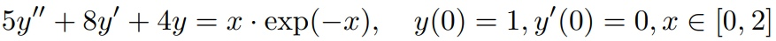
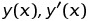
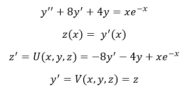
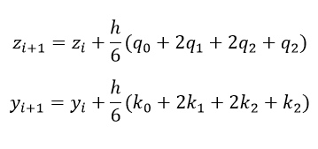
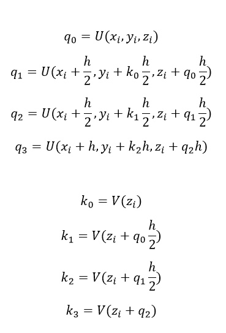
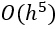
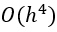

# Лабораторная работа № 7. Решение задачи Коши.

Выполнил студент группы 427  
Журавлев Кирилл Сергеевич

## Вариант № 10
Задание билета: Решить методом Рунге-Кутты 4-го порядка задачу Коши

с заданной относительной точностью 0,01.
Требуется построение графиков решения , а также фазовых траекторий.

## Теоретическая часть
**Метод разложения в ряд Тейлора**
Метод Рунге — Кутты четвёртого порядка при вычислениях с постоянным шагом интегрирования столь широко распространён, что его часто называют просто методом Рунге — Кутты.

Рассмотрим задачу Коши для системы обыкновенных дифференциальных уравнений первого порядка. 

Тогда приближенное значение в последующих точках вычисляется по итерационным формулам:

Вычисление нового значения проходит в четыре стадии для каждого из уравнений системы:

, где h — величина шага сетки по x.

Этот метод имеет четвёртый порядок точности. Это значит, что ошибка на одном шаге имеет порядок , а суммарная ошибка на конечном интервале интегрирования имеет порядок  .
## Практическая часть
Программа содержит ряд ключевых *функций*:
* **U** возвращает значение функции ***y"(x)*** в точке x.
* **V** - производная функции ***y"(x)***.
* **rk4funct1** - метод Рунге-Кутты 4-го порядка для первого уравнения системы.
* **rk4funct2** - метод Рунге-Кутты 4-го порядка для второго уравнения системы.

Последовательность запуска: компиляция части программы на с++, ее запуск, затем запускаем часть на python. 

### Результаты
В результате работы программы задача Коши  

была решена методом Тейлора 2-го порядка с заданной относительной точностью 0,01. Ниже приведены графики решения , а также фазовые траектории.

.png) .png) .png)
